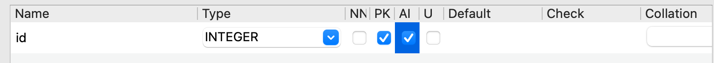
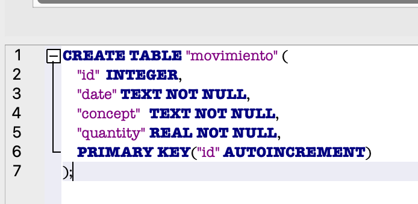
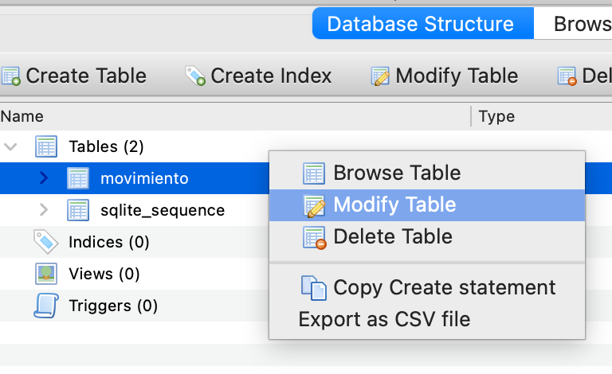

# Proyecto Backend - Pasos a seguir -  DEF   
  
- [ ] Crear carpeta del proyecto   
- [ ] Abrirla en Visual Studio Code   
- [ ] Crear los archivos necesarios iniciales:   
    - [ ] main.py  
    - [ ] .gitignore.py  
    - [ ] readme.md   
  
- [ ] Ahora vamos a crear el entorno virtual   
  
* **Crear el entorno: **  
    * **python3 -m venv entorno**  #Crear el entorno   
    * **source entorno/bin/activate** #activar el entorno . En Windows: .\entorno\Scripts\activate  
* Verifica que el entorno está activado!   
* Para desactivar el entorno: **deactivate **(enter desde la terminal)  
  
- [ ] **Instalar FastAPI: **  
    - [ ] **pip install “fastapi[standard]”  ** #Se instalan muchas librerías dentro del entorno (proyecto)   
    - [ ] Para saber que está instalado ejecuto el comando: **pip freeze** (ver que esté fastapi.. y otras librerías como pydantic)  
  
- [ ] **Crear archivo requirements.txt   #importante**, antes de enviar el proyecto hay que volver a lanzar este comando por si he instalado librerías nuevas.   
**	pip freeze > requirements.txt**  
  
- [ ] **Instalar BBDD **  
	- Para la BBDD hay que  crear archivo **“conexion.py” 	**e insertar el código para llamar a la BBDD** (ver otros archivos “conexión.py y copiar el código) **  
**	**- Para las consultas a la BBDD, crear archivo **“consultas.py” **  
**	**- Abrir** “DB Browser for SQLite” **desde mi carpeta** “aplicaciones” **del Mac.   
**	- Crear BBDD **desde el botón de la aplicación (arriba a la izquierda) en la misma carpeta del proyecto.   
	- Dar delata una tabla, por ejemplo que se llame “movimiento”   
	- Dar delata los campos de esta tabla (dando al icono pequeño “Añadir” y** crear SIEMPRE el campo “id” (clave primaria que no se puede tocar)**  
	tipo: integer, primary key y auto incremental (INTEGER, PK y AI)   
  
  
	- Crear los demás campos que hagan falta, por ejemplo “date” (TEXT, NOT NULL - NN), “concept” (TEXT, NN), etc.. “quantity” (REAL que es lo mismo que FLOAT y NN). Recordar que al marcar NN (Not Null) Significa que son obligatorios de rellenar).   
	  
	**- BUENAS PRÁCTICAS: **guardar la estructura de la creación de los campos en la tabla en un archivo para que el profesor o quien le interese pueda  
	ver o recrearla porque no tienen la BBDD. Entonces, copiar la estructura:   
  
	  
  
  
**GUARDAMOS LA TABLA **(dando al botón OK).   
  
Si en este punto no copié la estructura puedo verla otra vez modificando la tabla aquí:   
  
  
  
Y la pegamos en un archivo dentro del Visual Studio Code que llamaremos:** “create_tables.sql” **Tiene que ir con la extension .sql   
  
**NOTA:** Si tengo varias tablas, pego en este archivo todas las que tenga para que las pueda ver el profesor o persona interesada.   
  
- [ ] **Editar archivo conexión.py **  
  
Agregar el código de ++[conexion.py](http://conexion.py/)++ que ya hemos puesto en otros programas (es el mismo) y reemplazar el nombre de la BBDD). Ejemplo de código:   
  
“import sqlite3”  
  
class Conexion:  
    def __init__(self,sql_query,parametro=[]): #Inicializo clase  
        #conectar a la BBDD  
        self.con=sqlite3.connect("bd_ingresos_gastos.db")   
        #row factory para poder formatearlo   
        self.con.row_factory = sqlite3.Row    
        #creo el objeto de clase "cursor" para poder ejecutar las consultas a través de este método.    
        self.cur = self.con.cursor()  
        #Le paso la query "sql_query" y "parametro" en el caso que quiera hacer un INSERT, por ejemplo, en una lista.   
        self.res = self.cur.execute(sql_query,parametro)  
  
  
- [ ] **Editar archivo consultas.py **  
  
Copiar y pegar todo el código de ese mismo fichero del programa “intro-sqlite” y cambiarle el nombre de la tabla, porque las consultas a la BBDD son las mismas.   
  
  
  
  
